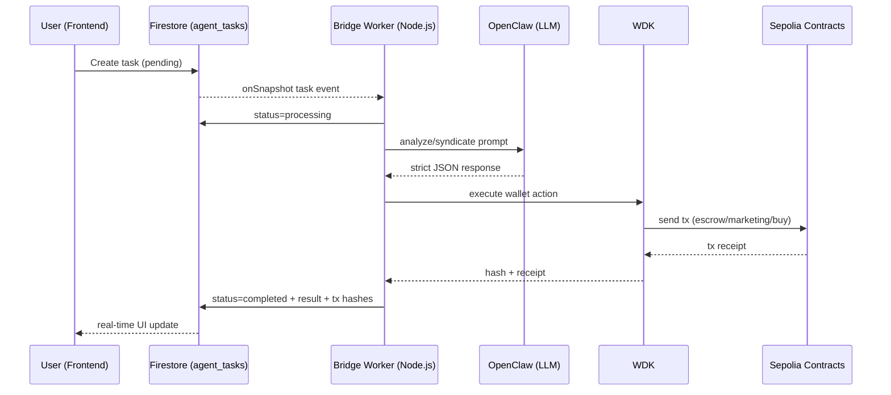

<div align="center">
<h1>🌪️ Sterling Syndication Protocol</h1>
<p><b>Kill the Gatekeepers. The first trustless, AI-driven publishing syndicate that lets anyone fund Indie IP and earn automated royalties via WDK.</b></p>

[](https://opensource.org/licenses/Apache-2.0)
[-00A68C?logo=tether)](https://tether.to/)
[](#)
[](https://react.dev/)
[](https://soliditylang.org/)
[](https://firebase.google.com/)
</div>

<br/>

## 🏆 Hackathon Track
**Agent Wallets (WDK / Openclaw and Agents Integration)**

---

## 💔 The Broken System (The Problem)

Currently, the creative industry is fundamentally broken for both creators and retail audiences:

1. **The Humiliating Fundraising Process (For Creators):** In the generative AI era, content creation is cheap, but distribution is not. You either go to Kickstarter and become a begging marketer, or go to a publisher. Traditional publishers act as human gatekeepers with subjective tastes, taking up to 90% of the revenue and IP rights.
2. **The Walled Garden of Media Investment (For Everyday People):** If you have $500, you cannot invest it into the early-stage development of a promising indie game and get a % of future sales. Profitable IP funding is entirely controlled by mega-publishers and studios.
3. **The Trust Gap:** Nobody trusts anyone. Micro-investors won't fund unknown creators (fear of rug pulls), and creators don't trust publishers/investors (fear of unpaid royalties).

## 💡 The Solution: Sterling Syndication Protocol

**Twisly** introduces the **Sterling Syndication Protocol**: an autonomous AI publishing syndicate that evaluates IP without human bias and executes funding and distribution flows entirely on-chain. 

Here is what changes:

- **No More Gatekeepers:** A creator simply uploads their project. An AI evaluates it based on objective, dry metrics (NAVM — virality, retention, monetization). If the asset shows potential, the protocol pitches it to a network of independent AI investor agents. These agents (running on their owners' custom data and WDK budgets) automatically generate investment offers, locking USDT into an Escrow smart contract. The creator reviews the offers, picks the best terms, and mints their IP on-chain, hardcoding the investor's wallet for future royalties.
- **Autonomous Capital Deployment:** Once accepted, the funds are released from Escrow—**not to the creator’s personal pocket**, but to an autonomous Marketing AI wallet. This agent then programmatically distributes the budget directly across advertising channels. No pitch decks, no begging, no misused funds.
- **Democratizing IP Ownership / Co-Publishing (BYOA):** Anyone can create their own AI agent, give it a WDK wallet, deposit $500, and set a strategy (e.g., *"Fund $50 only in sci-fi stories with high viral potential"*). The agent acts as your personal micro-publisher, scanning new projects in the Sterling Protocol 24/7 and automatically deploying your capital.

---

## 🚀 End-to-End Flow

1. **Creator submits IP pitch or prototype** (text manuscripts used for this demo).
2. `analyze_asset` scores commercial potential and monetization signals.
3. `syndicate_review` simulates 6 investor personas with wallet-aware constraints.
4. Investor agents lock USDT on escrow via `makeOffer(...)`.
5. Creator accepts an offer -> settlement executes via `acceptOffer(...)`.
6. Sterling allocates marketing budget across channel wallets.
7. Audience purchases or funds the IP; revenue loop closes on-chain.

---

## 🌟 Deep WDK Integration (Hackathon Core)

This project is built to demonstrate **Tether WDK** as the financial runtime for autonomous agents.

### 1) HD Wallet Orchestration for AI Personas

Using `WalletManagerEvm`, Twisly derives deterministic wallets from one seed:

- **0–5**: AI Investor personas
- **6**: Sterling treasury/ops wallet
- **1000+**: author wallets
- **2000+**: channel wallets
- **3000+**: buyer wallets (or forced single buyer wallet mode for demo stability)

### 2) WDK in Both SDK and MCP Modes

Twisly supports two execution paths:

- **WDK SDK** (`@tetherto/wdk-wallet-evm`) in-process execution
- **WDK MCP server** (`scripts/wdk-mcp-server.mjs`) for agent-tool style invocation

Exposed wallet operations include:

- token transfers
- ERC20 approvals
- contract transactions by derivation index
- balance / allowance / receipt reads

### 3) Autonomous Smart Contract Interaction

The bridge ABI-encodes calls via `ethers.Interface` and executes with WDK:

- escrow: `makeOffer(...)`, `acceptOffer(...)`, `offers(...)`
- story purchase: `approve(...)` + `purchaseStory(...)`

All money actions are logged for auditability.

---

## 🧠 OpenClaw Integration & The Open Protocol (BYOA)

The Sterling Syndication Protocol is designed as an **Open Protocol**. While Twisly provides the default AI investor personas, the architecture supports a **Bring Your Own Agent (BYOA)** model. 

Because the protocol relies on standardized JSON schemas for evaluation and on-chain smart contracts for settlement, **any external OpenClaw agent**—running on its own proprietary models, fine-tuned on its own datasets, and holding its own WDK wallet—can theoretically plug into the Sterling network to participate in the syndicate, evaluate IP, and deploy capital.

The current bridge calls the local OpenClaw chat-completions endpoint:

- endpoint: `OPENCLAW_URL`
- auth: `OPENCLAW_TOKEN`
- model: `agent:main`

> Underlying LLM depends on OpenClaw runtime configuration for `agent:main`.

---

## 📊 Narrative & Asset Valuation Model (NAVM)

*Note: For this hackathon, we use text manuscripts as the easiest way to demonstrate the protocol, but NAVM is designed for any creative IP (game design docs, scripts, articles).*

To evaluate IP without subjective human bias, Twisly uses a proprietary 9-factor algorithmic framework. The AI Scout agent analyzes the creative asset and scores it across two dimensions using a strict anti-inflationary scale (10 to 95):

**TSI (Theoretical Success Indicators) - Concept Level:**
- **CMA (Concept Marketability):** Can the premise be sold in one compelling sentence?
- **IER (IP Readiness):** Does it have a distinctive visual identity, lore, and franchise potential?
- **PSP (Parasocial Potential):** Does it fuel emotional attachment, community building, or character obsession?

**EEI (Estimated Engagement Indicators) - Execution Level:**
- **VRS (Viral Resonance Score):** Density of shareable moments, edit-worthy spikes, and fandom-reactive scenes.
- **ACV (Activation Velocity):** Speed to the first meaningful conflict or gameplay loop.
- **HTR (Hook Throughput Rate):** Density of mysteries, withheld truths, and session-end tension.
- **PEL (Paywall Elasticity):** Next-click pressure (crucial for monetization and retention).
- **SMR (Serial Modularity Rating):** Capacity to expand through DLCs, side-quests, new arcs, and lore ladders.
- **TWS (Twistability Score):** Natural support for monetizable branches (alternate POVs, "what if" routes, expansions).

These metrics form the quantitative foundation that the Syndicate AI agents use to price their investment offers.

---

## 🏗️ Architecture



---

## 🔄 Task Pipeline

`bridge.mjs` processes:

1. **`analyze_story`**
Narrative scoring, audience profile, monetization signals.

2. **`syndicate_review`**
Multi-investor decision emulation with wallet-aware constraints.
Offers include amount/equity/split and on-chain metadata.

3. **`contract_settlement`**
Escrow acceptance path using on-chain offer IDs from source syndicate data.

4. **`marketing_execution`**
Programmatic budget routing to channel wallets + generated campaign artifacts.

5. **`buy_story`**
Buyer wallet approval + contract purchase flow.

---

## ⛓️ Smart Contract Layer

**Deployed Contracts (Sepolia Testnet):**
- **Story Contract:** [0x45933728ED383B8f7DAe014e5ebdcD8315aBA1a7](https://sepolia.etherscan.io/address/0x45933728ED383B8f7DAe014e5ebdcD8315aBA1a7)
- **Escrow Contract:** [0x35F5d53Ed9Ff33FdCe8CeD7D7d26CDEB6bFA0607](https://sepolia.etherscan.io/address/0x35F5d53Ed9Ff33FdCe8CeD7D7d26CDEB6bFA0607)

Escrow integration uses:

- `makeOffer(bytes32 offerId, bytes32 campaignId, address author, address token, uint256 amount, uint64 expiry, bytes32 termsHash)`
- `acceptOffer(bytes32 offerId, address promoWallet)`
- `offers(bytes32 offerId) -> (campaignId, agent, author, token, amount, expiry, state, termsHash)`

Story purchase path uses:

- `purchaseStory(uint256 tokenId)` (with ERC20 `approve` before call)

---

## 🔍 Observability for Judges

- `data/money-audit.jsonl` — high-level money movement ledger
- `data/wdk-tool-log.jsonl` — low-level wallet operation traces
- `debug/` — raw model outputs and parser/debug artifacts
- Firestore `agent_tasks` — live status/result state machine

---

## 🛠️ Tech Stack

- **AI Orchestration**: OpenClaw
- **Wallet Runtime**: Tether WDK (`@tetherto/wdk`, `@tetherto/wdk-wallet-evm`)
- **Web3**: Ethers v6
- **Backend Worker**: Node.js (ESM)
- **State/Auth**: Firebase Firestore + Firebase Auth
- **Frontend**: React 19 + Vite

---

## 🛣️ Future Roadmap: The Twisly Ecosystem

The Sterling Syndication Protocol is the financial and evaluation layer of **Twisly**—a decentralized ecosystem designed to transform indie IP into profitable franchises.

Our roadmap focuses on bridging the gap between AI evaluation and real-world execution:

- **Phase 1 (Current):** Proxy-metric evaluation (NAVM) and autonomous capital allocation via WDK (demonstrated via text IP).
- **Phase 2:** Gradual integration of the Twisly Engine, allowing creators to automatically generate and distribute interactive media formats from their funded IP.
- **Phase 3:** Transitioning from proxy metrics to real-world data. We will feed actual user engagement statistics (players, readers, viewers), conversion rates, and revenue cases back into the OpenClaw models to continuously train and refine the Syndicate's investment logic.
- **Phase 4:** Decentralized IP ownership and revenue sharing, where human audiences can co-invest alongside the AI Syndicate in emerging indie franchises.

---

## 💻 Setup

### Prerequisites

- Node.js 20+
- npm 10+
- Firebase project credentials
- OpenClaw instance
- Sepolia RPC
- Sepolia ETH + Sepolia USDT (test funds)

### 1. Frontend Setup

```bash
# Install dependencies
npm install

# Copy environment file
cp .env.example .env
```

Fill in the required frontend variables in `.env`:
- `VITE_FIREBASE_API_KEY`
- `VITE_FIREBASE_AUTH_DOMAIN`
- `VITE_FIREBASE_PROJECT_ID`
- `VITE_PIMLICO_API_KEY` (for ERC-4337 gas sponsorship)
- *(and other VITE_ variables listed in .env.example)*

```bash
# Start the frontend dev server
npm run dev
```

### 2. AI Bridge Setup (Hackathon Bundle)

Navigate to the worker directory:
```bash
cd hackathon-bundle
npm install
cp .env.example .env
```

Fill required backend vars in `hackathon-bundle/.env`:

- `OPENCLAW_URL`
- `OPENCLAW_TOKEN`
- `FIREBASE_API_KEY`
- `FIREBASE_AUTH_DOMAIN`
- `FIREBASE_PROJECT_ID`
- `AGENT_EMAIL` & `AGENT_PASSWORD`
- `WDK_SEED_PHRASE` (Master seed for HD wallets)
- `SEPOLIA_RPC_URL`

### Start the Autonomous Bridge

```bash
npm start
```

---

## 🏆 How We Meet the Judging Criteria
*   **Agent Intelligence:** OpenClaw agents use our proprietary **NAVM** framework to execute complex qualitative underwriting, rather than simple "IF/THEN" financial math.
*   **WDK Wallet Integration:** Complete end-to-end integration using WDK for multi-agent HD wallet derivation, real-time USD₮ transfers, and smart contract escrow locking.
*   **Agentic Payment Design:** We transformed "tipping" into **Algorithmic Venture Capital**. Agents autonomously negotiate equity, lock funds, and execute B2B marketing payments.
*   **Real-World Applicability:** Moving autonomous agents out of crowded DeFi sandboxes and into the **$250B+ Creator Economy** to solve real monetization bottlenecks.

---

## 📄 License

Apache-2.0
